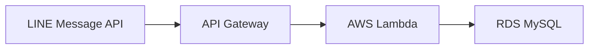
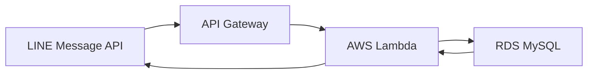
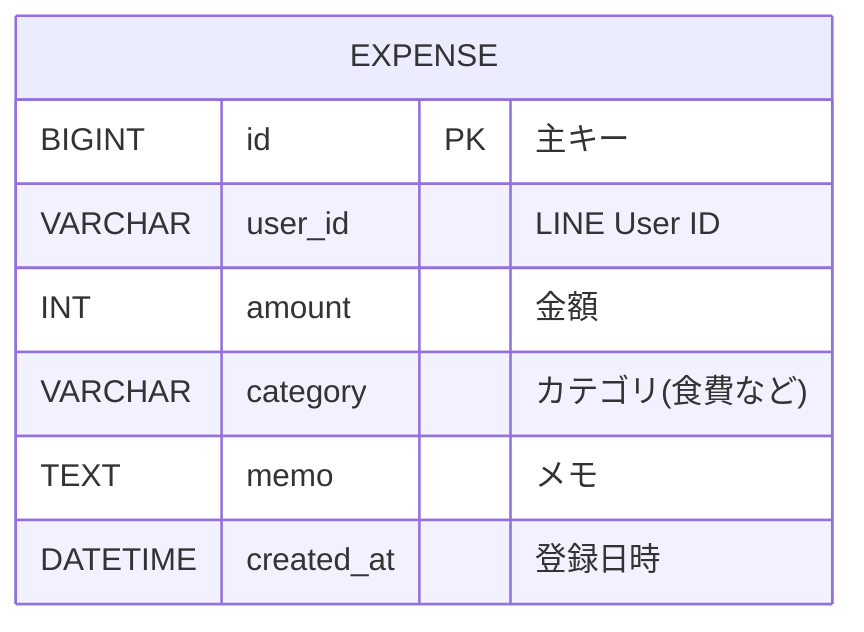

<<<<<<< HEAD
## 1.概要
過去に解いた競技プログラミング(Atcoderを想定)の問題、自分のコード、タグ(DP,グラフ,累積話など)、使用言語を管理し後に検索ができるWebアプリ

いちいち検索するのがめんどくさいけどたまに使うものを保存しておいたり、あるアルゴリズムを使った自身の以前の回答を確認したりできる。

ターゲット:競技プログラミングに取り組む学生

## 2.システム構成

**フロントエンド**
* **がんばれ~~~~~また相談します。基本何でもいいよ。なんならJSじゃなくてもいい**
* **けんちゃんが思うように作ってくれていいんだけど初期画面で一覧表示するのか検索だけにするんかとか**
* **一覧にするなら問題とタグの表示を同時にした方がいいとか分けた方がいいとか考えること意外とある**

**バックエンド**
* **言語/フレームワーク: Java21/ Spring Boot 4.0.3**
* **データベース:未定(おそらくMySQL)**
* **インフラ:未定(データベース作りっぱなしにしとったらAWSの無料クレジット無くなっちゃったからどうするか考える)**

## 3.

* **問題を紐付けながらアルゴリズムやライブラリを保存する**
* **コードのステータスとコメントを保存できる(<-これいる?)**
* **累積和や動的計画法などのタグをつけてタグによる絞り込みができるようにする**
## 4.API設計
### 問題
| HTTPメソッド |　エンドポイント(URL)　|　処理の概要 |
| :---:| :---:|:---:|
|GET | /api/problems | 問題一覧を取得する |
|POST| /api/problems| 新しい問題を追加する |
|GET | /api/problems/{id} | 特定の問題の詳細を取得する |
|PUT | /api/problems/{id}| 問題の情報を更新する |
|DELETE | /api/problems/{id} | 問題を削除する |
|GET| /api/problems?tag=DP | タグで絞り込み検索をする |

### 提出コード
| HTTPメソッド | エンドポイント(URL) | 処理の概要 |
| :---: | :---: | :---: |
|GET | /api/problems/{id}/submissions | 問題に紐づく提出コード一覧を取得 |
|POST | /api/problems/{id}/submissions |　提出コードを追加する |
|PUT | /api/submissions/{id} | 提出コードを更新する |
|DELETE | /api/submissions/{id} | 提出コードを削除する |

### タグ
| HTTPメソッド | エンドポイント(URL) | 処理の概要 |
| :---: | :---:| :---:|
| GET | /api/tags | タグ一覧を取得する |
| POST | /api/tags | 新しいタグを登録する |
| DELETE | /api/tags/{id} |  タグを削除する |

## 5.データモデル
データベースどんな感じで設計するかまだ考えよる
### Problemtテーブル
| フィールド名 | 型| 必須 | 説明 |
| :---:| :---:| :---:||:---:|
| id | Long |
| title|
| difficulty|
| url|
| memo|
| createdAt|

## Submission
|フィールド名| 型 | 必須 | 説明 |
| :---:| :---: | :---:| :---:|
| id |

## 6.リクエスト・ボディ

## 7.HTTPステータスコード
| コード | 意味 | 使用場面 |
| 200 OK | 成功
| 201 Created |
| 204 No Content |
| 400 Bad Request |
| 404 Not Found |
| 500 Internal Server Error |

## 8.今後の拡張予定
=======
## 制作背景
家計簿をつけるにあたって支出の入力の手間が課題となっていた。

そのためLINE上で支出をつけるようにすることによって入力を継続しやすくなると考えた。

## 技術選定
| 技術 | 選定理由 |
|:--| :-- |
|LINE Message API | 入力の手間を省き、継続率を上げるため |
|Lambda| 入力のタイミングでサーバーが起動するLambdaはシステムを使用する時間が少ない家計簿アプリに適切であるから|
|RDS MySQL|支出の合計を出力する必要があったため|
|Secrets Manager| データベースのパスワードを安全に扱うため |

## アーキテクチャ図
ユーザーの支出を保存

グラフを出力

## 使用方法
ユーザーがLINEで[1200 食費 メモ]のように送ると
DBに1200,食費が保存される
ユーザーが[グラフ]と送るとDBの情報を集計し、テキストで日ごとの使用金額がラインで送られてくる
## DBの設計

ユーザごとにデータを分離している
## Lambdaの機能
DailyTotal.java:[日付、その日の支出の合計金額]を1セットにまとめるデータ型を定義

DbAccess.java:SQLにアクセスし、支出情報をINSERTする

DbConfig.java:データベース接続に必要な情報を1つにまとめて管理する

GetStatus.java:SQLから日別の支出合計を取得する

Handler.java:LINEのメッセージをJSONから取り出し、メインの処理を行う。

JdbcUtil.java:JavaオブジェクトからJDBC用のURLを作る

SecretsUtil.java:AWS Secrets Managerから秘密情報(DBのパスワードなど)を取り出してくる

FormatStatus.java:フォーマットの情報を保持

FormatCheck.java:フォーマットがあっているか確認

## Lambdaのメイン処理
1.API GatewayからのWebhook JSONを受け取る

2.Messageからtextを取り出す

3.入力形式を判定
  [数字、カテゴリ、メモ]ならSQLにINSERT
  [グラフ]ならSQLからSELECTし、集計したデータをLINEで返す
  
## セキュリティ
DBパスワードをAWS Secrets Managerに保存
Lambdaには環境変数のみを記述
## 今後の改善案
ユーザーからの入力の型をより自由にする
入力の取り消しを可能にする
月ごとの合計金額や、カテゴリーごとの合計金額を出力する
過去にさかのぼって支出の入力、取り消しを可能にするためにDBに新しいカラムを追加する
>>>>>>> b3da2f506e003b276161cdf1a0d0c5cc343f81d1
